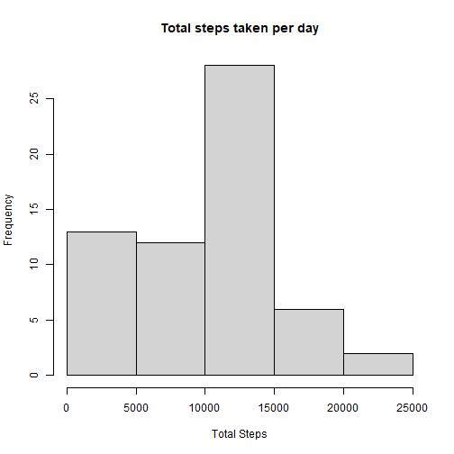
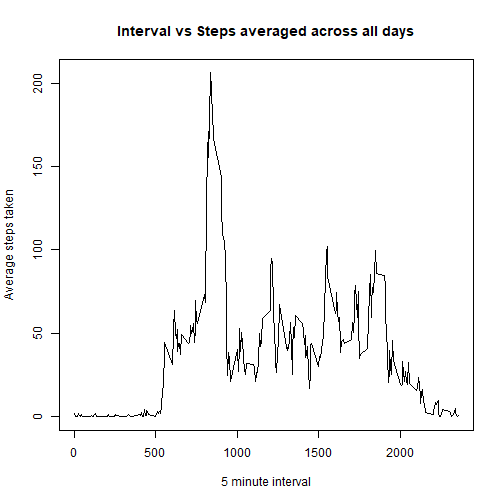
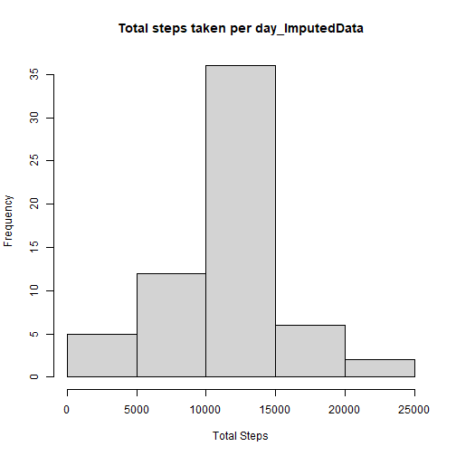
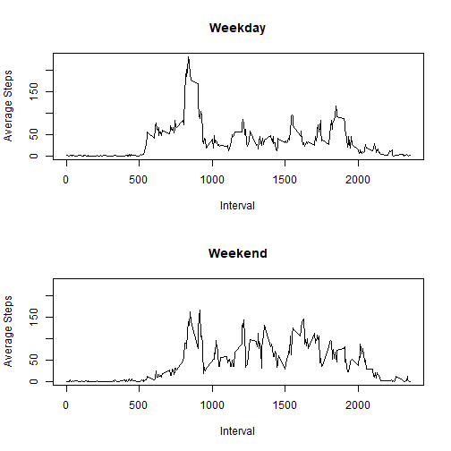

# Course Project 1
============================

Download and unzip data
check that activity.csv is visible in files

``` r
url <- "https://d396qusza40orc.cloudfront.net/repdata%2Fdata%2Factivity.zip"
download.file(url, destfile="amd.zip", method="auto")
unzip("amd.zip")
list.files()
```

```
##  [1] "activity.csv"                  "activity.zip"                 
##  [3] "amd.zip"                       "doc"                          
##  [5] "figure"                        "instructions_fig"             
##  [7] "PA1_template.html"             "PA1_template.md"              
##  [9] "PA1_template.Rmd"              "README.md"                    
## [11] "RepData_PeerAssessment1.Rproj"
```

read the data

``` r
amd_data <- read.csv(file="activity.csv")
```

## mean total number of steps taken per day

Make a histogram of the total number of steps taken each day

``` r
library(dplyr)
amd_data1 <- amd_data %>%
  group_by(date) %>%
  summarise(total_steps=sum(steps, na.rm=TRUE))

hist(amd_data1$total_steps, xlab="Total Steps",
     main="Total steps taken per day")
```



Calculate and report the mean and median total number of steps taken per day

``` r
mean_steps <- mean(amd_data1$total_steps, na.rm=TRUE)
median_steps <- median(amd_data1$total_steps, na.rm=TRUE)
```
mean steps taken per day is 9354.2295082 and median steps taken per day is 10395

## average daily activity pattern

Make a time series plot (i.e. type = "l") of the 5-minute interval (x-axis) and the average number of steps taken, averaged across all days (y-axis)

``` r
amd_data2 <- amd_data %>%
  group_by(interval) %>%
  summarise(mean_steps=mean(steps, na.rm=TRUE))

plot(amd_data2$interval, amd_data2$mean_steps, type="l",
     xlab="5 minute interval", ylab="Average steps taken",
     main="Interval vs Steps averaged across all days")
```



Which 5-minute interval, on average across all the days in the dataset, contains the maximum number of steps?

``` r
maxsteps_interval <- amd_data2$interval[which.max(amd_data2$mean_steps)]
maxsteps <- max(amd_data2$mean_steps)
```
interval is 835 and maxsteps is 206.1698113.

## Imputing missing values

Calculate and report the total number of missing values in the dataset (i.e. the total number of rows with NAs)

``` r
NA_values <- sum(!complete.cases(amd_data))
```
The total number of rows with NA values is 2304.

filling in all of the missing values and create new dataset

``` r
amd_imputed <- amd_data %>%
  left_join(amd_data2, by="interval") %>%
  mutate(steps = ifelse(is.na(steps), mean_steps, steps))
```
imputation uses mean values


Make a histogram of the total number of steps taken each day and Calculate and report the mean and median total number of steps taken per day

``` r
amd_imputed1 <- amd_imputed %>%
  group_by(date) %>%
  summarise(total_steps=sum(steps, na.rm=TRUE))

hist(amd_imputed1$total_steps, xlab="Total Steps",
     main="Total steps taken per day_ImputedData")
```



``` r
mean_steps <- mean(amd_imputed1$total_steps)
median_steps <- median(amd_imputed1$total_steps)
```
mean steps taken per day is 1.0766189 &times; 10<sup>4</sup> and median steps taken per day is 1.0766189 &times; 10<sup>4</sup> for imputed data

## differences in activity patterns between weekdays and weekends?

Create a new factor variable in the dataset with two levels -- "weekday" and "weekend" indicating whether a given date is a weekday or weekend day

``` r
amd_imputed$date <- as.Date(amd_imputed$date)

amd_imputed <- amd_imputed %>%
  mutate(day_type = ifelse(weekdays(date) %in% c("Saturday", "Sunday"), "weekend", "weekday"))

amd_imputed$day_type <- factor(amd_imputed$day_type, levels=c("weekend", "weekday"))
```

Make a panel plot containing a time series plot (i.e. type = "l") of the 5-minute interval (x-axis) and the average number of steps taken, averaged across all weekday days or weekend days (y-axis). 

``` r
avg_steps_daytype <- amd_imputed %>%
  group_by(interval, day_type) %>%
  summarise(mean_steps = mean(steps, na.rm=TRUE))
```

```
## `summarise()` has regrouped the output.
## ℹ Summaries were computed grouped by interval and day_type.
## ℹ Output is grouped by interval.
## ℹ Use `summarise(.groups = "drop_last")` to silence this message.
## ℹ Use `summarise(.by = c(interval, day_type))` for per-operation grouping
##   (`?dplyr::dplyr_by`) instead.
```

``` r
par(mfrow=c(2,1))
ylim <- range(avg_steps_daytype$mean_steps)

with(subset(avg_steps_daytype, day_type=="weekday"),
     plot(interval, mean_steps, type="l",
          main="Weekday", xlab="Interval", ylab="Average Steps",
          ylim=ylim))

with(subset(avg_steps_daytype, day_type=="weekend"),
     plot(interval, mean_steps, type="l",
          main="Weekend", xlab="Interval", ylab="Average Steps",
          ylim=ylim))
```




# End of assignment


